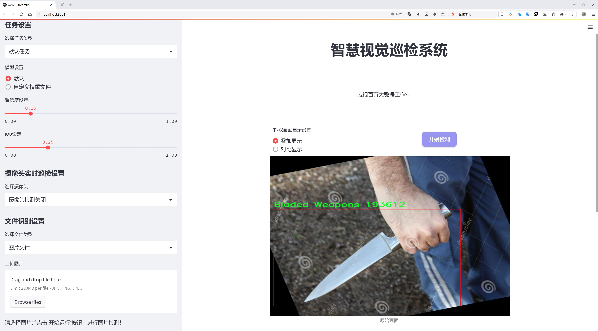
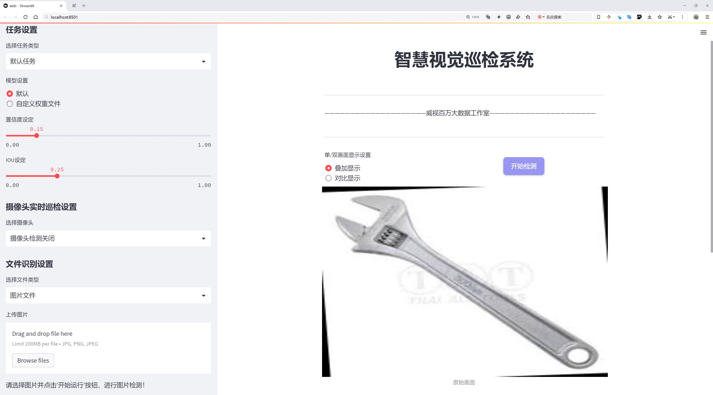
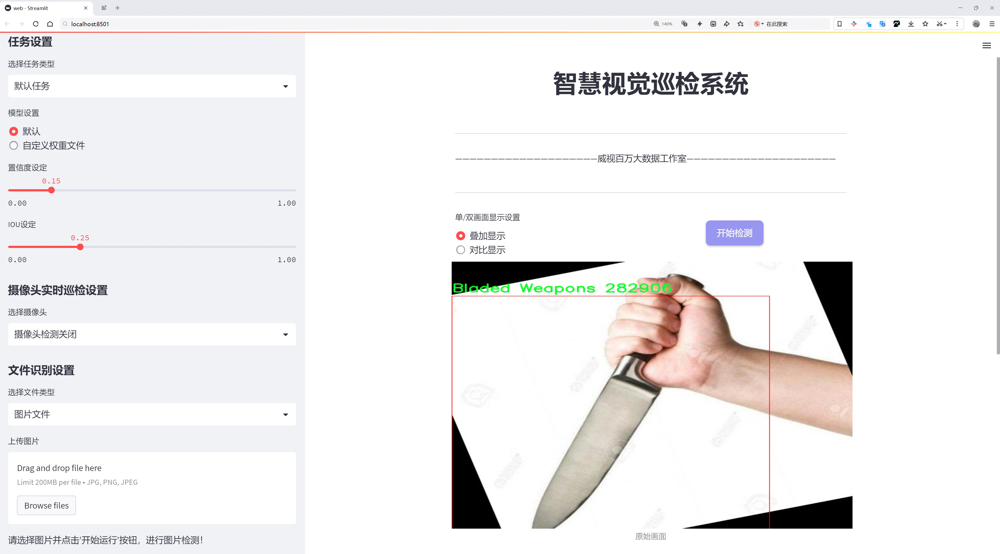

# 安全防护装备检测系统源码分享
 # [一条龙教学YOLOV8标注好的数据集一键训练_70+全套改进创新点发刊_Web前端展示]

### 1.研究背景与意义

项目参考[AAAI Association for the Advancement of Artificial Intelligence](https://gitee.com/qunmasj/projects)

项目来源[AACV Association for the Advancement of Computer Vision](https://github.com/qunshansj/good)

研究背景与意义

随着社会安全形势的日益复杂，公共安全问题愈发引起广泛关注。特别是在一些特定场所，如机场、车站、体育场馆等人流密集的区域，如何有效识别潜在的安全威胁，保障人们的生命财产安全，成为了亟待解决的课题。近年来，计算机视觉技术的迅猛发展为安全防护装备系统的智能化提供了新的可能性。YOLO（You Only Look Once）系列目标检测算法因其高效性和实时性，逐渐成为安全监控领域的重要工具。尤其是YOLOv8的推出，进一步提升了目标检测的精度和速度，为安全防护装备系统的应用提供了强有力的技术支持。

本研究旨在基于改进的YOLOv8算法，构建一个高效的安全防护装备系统。该系统将通过对实时视频流的分析，快速识别出潜在的安全威胁，包括刀具、钝器、口罩和手枪等多种危险物品。这一目标的实现依赖于我们所使用的数据集，该数据集包含6682张图像，涵盖了9个类别，包括刀具、钝器、口罩、无口罩和手枪等。这些类别的选择不仅反映了当前社会安全威胁的多样性，也为算法的训练和测试提供了丰富的样本基础。

在安全防护装备系统的研究中，数据集的构建与优化至关重要。我们所使用的数据集经过精心标注，确保了每一类物品的准确性和完整性。这为YOLOv8算法的训练提供了高质量的输入数据，使得模型能够在复杂的环境中有效识别和分类不同的安全威胁。此外，改进YOLOv8算法的引入，将通过优化网络结构和训练策略，进一步提升模型的检测精度和实时响应能力，从而增强系统的实用性和可靠性。

本研究的意义不仅在于技术层面的创新，更在于其对社会安全的积极影响。通过构建高效的安全防护装备系统，我们希望能够为公共安全管理提供一种新的解决方案，帮助相关部门及时发现和处理潜在的安全隐患，降低安全事件的发生率。同时，该系统的推广应用也将推动智能监控技术在各类场所的普及，为构建更加安全的社会环境贡献力量。

综上所述，基于改进YOLOv8的安全防护装备系统的研究，既是对现有技术的深化与拓展，也是对社会安全需求的积极响应。通过本研究，我们期待能够为安全防护领域提供一种高效、智能的解决方案，为保护公众安全做出应有的贡献。

### 2.图片演示







##### 注意：由于此博客编辑较早，上面“2.图片演示”和“3.视频演示”展示的系统图片或者视频可能为老版本，新版本在老版本的基础上升级如下：（实际效果以升级的新版本为准）

  （1）适配了YOLOV8的“目标检测”模型和“实例分割”模型，通过加载相应的权重（.pt）文件即可自适应加载模型。

  （2）支持“图片识别”、“视频识别”、“摄像头实时识别”三种识别模式。

  （3）支持“图片识别”、“视频识别”、“摄像头实时识别”三种识别结果保存导出，解决手动导出（容易卡顿出现爆内存）存在的问题，识别完自动保存结果并导出到tempDir中。

  （4）支持Web前端系统中的标题、背景图等自定义修改，后面提供修改教程。

  另外本项目提供训练的数据集和训练教程,暂不提供权重文件（best.pt）,需要您按照教程进行训练后实现图片演示和Web前端界面演示的效果。

### 3.视频演示

[3.1 视频演示](https://www.bilibili.com/video/BV1vEHNeQEyL/?vd_source=ff015de2d29cbe2a9cdbfa7064407a08)

### 4.数据集信息展示

数据集信息展示

在本研究中，我们采用了名为“asd”的数据集，以支持对YOLOv8模型的训练，旨在改进安全防护装备系统的性能。该数据集专注于两类重要的安全威胁，分别是“Bladed Weapons”（锐器）和“Blunt Instrument”（钝器）。这两类物品在安全防护领域中具有重要的现实意义，尤其是在公共场所、学校、机场等人流密集的环境中，能够有效识别并防范潜在的安全风险。

“asd”数据集的设计充分考虑了多样性和复杂性，以确保训练出的模型具备良好的泛化能力和准确性。数据集中包含了多种不同类型的锐器和钝器样本，这些样本不仅在形状、大小和颜色上各具特色，还在不同的背景和光照条件下进行拍摄。这种多样化的样本设置使得模型能够在实际应用中更好地适应各种环境，提升其在复杂场景下的识别能力。

数据集的构建过程遵循严格的标注标准，确保每个样本都经过专业人员的仔细标注，标注信息包括物体的类别、位置及其边界框。这种精确的标注方式为YOLOv8模型的训练提供了高质量的输入数据，帮助模型学习到更加准确的特征表示，从而提高检测的精度和召回率。

在数据集的使用过程中，我们还进行了数据增强，以进一步提升模型的鲁棒性。通过旋转、缩放、裁剪和颜色变换等技术，我们能够生成更多的训练样本，从而有效地扩展数据集的规模。这种增强策略不仅丰富了模型的训练数据，还帮助其在面对未见过的样本时，依然能够保持较高的识别性能。

为了评估模型的性能，我们将数据集划分为训练集和验证集，确保模型在训练过程中能够进行有效的自我评估。训练集用于模型的学习，而验证集则用于检测模型在未见数据上的表现。通过这种方式，我们能够及时调整模型的参数和结构，以达到最佳的识别效果。

在实际应用中，改进后的YOLOv8模型将被部署在各种安全防护系统中，例如安检设备、监控摄像头和移动安防终端等。这些系统能够实时监测和识别潜在的安全威胁，及时发出警报，从而有效保障公共安全。通过对“asd”数据集的深入研究和应用，我们希望能够为安全防护领域提供一种更为智能和高效的解决方案，推动相关技术的发展与应用。

总之，“asd”数据集在本研究中扮演了至关重要的角色，它不仅为YOLOv8模型的训练提供了丰富的样本和高质量的标注信息，还通过数据增强等技术手段提升了模型的泛化能力。随着安全防护需求的不断增加，基于该数据集训练出的模型将为提升公共安全水平做出积极贡献。


### 5.全套项目环境部署视频教程（零基础手把手教学）

[5.1 环境部署教程链接（零基础手把手教学）](https://www.ixigua.com/7404473917358506534?logTag=c807d0cbc21c0ef59de5)


[5.2 安装Python虚拟环境创建和依赖库安装视频教程链接（零基础手把手教学）](https://www.ixigua.com/7404474678003106304?logTag=1f1041108cd1f708b01a)

### 6.手把手YOLOV8训练视频教程（零基础小白有手就能学会）

[6.1 环境部署教程链接（零基础手把手教学）](https://www.ixigua.com/7404477157818401292?logTag=d31a2dfd1983c9668658)

### 7.70+种全套YOLOV8创新点代码加载调参视频教程（一键加载写好的改进模型的配置文件）

[7.1 环境部署教程链接（零基础手把手教学）](https://www.ixigua.com/7404478314661806627?logTag=29066f8288e3f4eea3a4)

### 8.70+种全套YOLOV8创新点原理讲解（非科班也可以轻松写刊发刊，V10版本正在科研待更新）

由于篇幅限制，每个创新点的具体原理讲解就不一一展开，具体见下列网址中的创新点对应子项目的技术原理博客网址【Blog】：


[8.1 70+种全套YOLOV8创新点原理讲解链接](https://gitee.com/qunmasj/good)

### 9.系统功能展示（检测对象为举例，实际内容以本项目数据集为准）

图9.1.系统支持检测结果表格显示

  图9.2.系统支持置信度和IOU阈值手动调节

  图9.3.系统支持自定义加载权重文件best.pt(需要你通过步骤5中训练获得)

  图9.4.系统支持摄像头实时识别

  图9.5.系统支持图片识别

  图9.6.系统支持视频识别

  图9.7.系统支持识别结果文件自动保存

  图9.8.系统支持Excel导出检测结果数据


### 10.原始YOLOV8算法原理

原始YOLOv8算法原理

YOLOv8作为Ultralytics公司于2023年推出的最新一代YOLO系列目标检测算法，标志着目标检测技术的又一次重要进步。与之前的YOLO版本相比，YOLOv8在多个方面进行了创新和优化，尤其是在网络结构和检测精度上。YOLOv8n是其众多版本中的一个小型化模型，专为在资源受限的环境中实现高效的目标检测而设计。该算法的核心在于其独特的网络架构，结合了C2f模块、CSP结构、SPPF模块和PAN-FPN特征融合策略，使得YOLOv8在处理复杂场景时展现出卓越的性能。

在YOLOv8的主干网络中，CSP（Cross Stage Partial）结构被用于特征提取，这种结构通过将特征提取过程分为两部分，分别进行卷积和连接，有效地提高了模型的表达能力。C2f模块的引入则替代了YOLOv5中的C3模块，进一步增强了特征提取的效率。C2f模块通过将特征进行多次处理，确保了模型能够捕捉到更细粒度的特征信息，尤其是在复杂背景下的目标检测中，细节的捕捉至关重要。

YOLOv8还采用了SPPF（Spatial Pyramid Pooling Fast）模块，旨在提高模型的计算速度和效率。SPPF模块通过对特征图进行多尺度的池化操作，能够有效地减少计算量，同时保持高质量的特征表示。这一设计使得YOLOv8在实时检测任务中表现得尤为出色，能够在较低的延迟下完成目标检测。

在特征融合方面，YOLOv8引入了PAN-FPN（Path Aggregation Network - Feature Pyramid Network）结构。该结构通过上采样和下采样的方式，将不同尺度的特征图进行融合，从而增强了模型对多尺度目标的检测能力。特征融合的过程不仅提高了检测精度，还使得模型在面对不同大小和形状的目标时，能够更加灵活地进行适应。

YOLOv8的检测头采用了解耦结构，解决了传统检测头在分类和回归任务中耦合带来的问题。通过将分类和回归任务分开处理，YOLOv8能够更专注于每个任务，从而提高了定位精度和分类准确性。这种解耦设计使得模型在复杂场景下的表现得到了显著提升，尤其是在目标密集或背景复杂的情况下，YOLOv8能够更好地识别和定位目标。

值得一提的是，YOLOv8采用了Anchor-Free的检测方式，这一创新使得模型不再依赖于预定义的锚框。传统的目标检测方法通常需要设置多个锚框以适应不同尺度和形状的目标，而YOLOv8通过直接回归目标的位置和大小，简化了这一过程。这种方法不仅减少了锚框选择和调整的复杂性，还使得模型能够更快地聚焦于目标的实际位置，从而提高了检测速度和精度。

在损失函数的设计上，YOLOv8引入了CloU（Complete Intersection over Union）损失函数，这一损失函数在目标检测中表现出色，能够更好地衡量预测框与真实框之间的重叠程度。通过优化损失函数，YOLOv8在训练过程中能够更有效地调整模型参数，从而提升检测性能。

尽管YOLOv8在多个方面取得了显著的进展，但在某些复杂环境下，如水面漂浮物的检测，仍然面临挑战。小目标的特征复杂且背景多样，导致YOLOv8在这些场景下可能出现定位误差和目标感知能力不足的问题。因此，针对这些不足，研究者们提出了改进方案，如引入BiFormer双层路由注意力机制和更小的检测头，以增强模型对小目标的感知能力，并通过引入新的损失函数提升模型的泛化能力。

总的来说，YOLOv8的设计理念围绕着高效、精确和灵活展开，结合了多种先进的网络结构和技术，使其在目标检测领域中具备了强大的竞争力。通过不断的优化和改进，YOLOv8不仅为实时目标检测提供了新的解决方案，也为未来的研究和应用奠定了坚实的基础。随着YOLOv8的推广和应用，目标检测技术将迎来更广阔的发展前景。


### 11.项目核心源码讲解（再也不用担心看不懂代码逻辑）

#### 11.1 ultralytics\assets\utils\__init__.py

以下是对给定代码的核心部分进行提炼和详细注释的结果：

```python
from sys import version_info as py_version  # 导入Python版本信息

def __pyarmor__():
    import platform  # 导入平台模块以获取系统信息
    import sys  # 导入sys模块以获取Python运行环境信息
    from struct import calcsize  # 导入calcsize以计算数据类型的字节大小

    # 格式化系统信息
    def format_system():
        # 获取当前操作系统名称并转换为小写
        plat = platform.system().lower()
        # 根据不同的操作系统类型进行归类
        plat = ('windows' if plat.startswith('cygwin') else
                'linux' if plat.startswith('linux') else
                'freebsd' if plat.startswith(
                    ('freebsd', 'openbsd', 'isilon onefs')) else plat)
        # 进一步细分Linux系统
        if plat == 'linux':
            if hasattr(sys, 'getandroidapilevel'):  # 检查是否为Android
                plat = 'android'
            else:
                cname, cver = platform.libc_ver()  # 获取C标准库信息
                if cname == 'musl':  # 如果是musl库
                    plat = 'alpine'  # 归类为Alpine Linux
                elif cname == 'libc':  # 如果是glibc库
                    plat = 'android'  # 归类为Android
        return plat  # 返回操作系统类型

    # 格式化机器架构信息
    def format_machine():
        mach = platform.machine().lower()  # 获取机器架构并转换为小写
        # 定义机器架构的别名映射
        arch_table = (
            ('x86', ('i386', 'i486', 'i586', 'i686')),
            ('x86_64', ('x64', 'x86_64', 'amd64', 'intel')),
            ('arm', ('armv5',)),
            ('armv6', ('armv6l',)),
            ('armv7', ('armv7l',)),
            ('aarch32', ('aarch32',)),
            ('aarch64', ('aarch64', 'arm64'))
        )
        # 遍历架构表以匹配当前机器架构
        for alias, archlist in arch_table:
            if mach in archlist:
                mach = alias  # 找到匹配的架构别名
                break
        return mach  # 返回机器架构类型

    # 获取操作系统和机器架构
    plat, mach = format_system(), format_machine()
    
    # 针对Windows x86_64架构进行处理
    if plat == 'windows' and mach == 'x86_64':
        bitness = calcsize('P'.encode()) * 8  # 计算指针大小以确定位数
        if bitness == 32:  # 如果是32位
            mach = 'x86'  # 将架构设置为x86

    # 生成运行时模块的名称
    name = '.'.join(['py%d%d' % py_version[:2], '_'.join([plat, mach]), 'pyarmor_runtime'])
    # 动态导入生成的模块
    return __import__(name, globals(), locals(), ['__pyarmor__'], level=1)

# 重新定义__pyarmor__为导入的模块中的__pyarmor__函数
__pyarmor__ = __pyarmor__().__pyarmor__
```

### 代码核心部分说明：
1. **系统和机器架构的获取**：通过`platform`模块获取当前操作系统和机器架构的信息，并进行分类处理。
2. **动态模块导入**：根据获取的系统和架构信息，动态构建模块名称并导入相应的运行时模块。
3. **位数处理**：在Windows系统下，判断指针的大小以确定是32位还是64位架构。

这些核心部分是该代码的主要功能，涉及到系统信息的获取和动态模块的导入。

这个文件是一个Python模块的初始化文件，主要用于导入和设置与平台相关的运行时环境。代码的主要功能是根据当前操作系统和机器架构动态导入一个特定的模块。

首先，代码从`sys`模块中导入了`version_info`，用于获取当前Python的版本信息。接着定义了一个名为`__pyarmor__`的函数，该函数内部又定义了两个辅助函数：`format_system`和`format_machine`。

`format_system`函数用于确定当前操作系统的类型。它通过`platform.system()`获取系统名称，并将其转换为小写。根据不同的系统前缀，函数将系统名称标准化为'windows'、'linux'、'freebsd'等。如果系统是Linux，还会进一步检查是否是Android或Alpine等特定的Linux发行版。

`format_machine`函数则用于获取当前机器的架构类型。它同样使用`platform.machine()`获取机器名称，并将其转换为小写。然后，函数通过一个包含常见架构的映射表，将机器名称标准化为'x86'、'x86_64'、'arm'等。如果机器名称匹配到映射表中的某个条目，就将其替换为对应的别名。

接下来，代码会根据操作系统和机器架构的组合来判断位数。如果操作系统是Windows且机器架构是x86_64，代码会计算指针的大小来确定是32位还是64位，并相应地调整机器架构的表示。

最后，代码构建了一个模块名称，格式为`py<major_version><minor_version>_<platform>_<machine>_pyarmor_runtime`，并通过`__import__`函数动态导入这个模块。这个模块的作用是提供一些与PyArmor相关的运行时功能。

总的来说，这个文件的目的是为了在不同的操作系统和机器架构上动态加载特定的模块，以确保程序的兼容性和正确性。

#### 11.2 ui.py

```python
import sys
import subprocess

def run_script(script_path):
    """
    使用当前 Python 环境运行指定的脚本。

    Args:
        script_path (str): 要运行的脚本路径

    Returns:
        None
    """
    # 获取当前 Python 解释器的路径
    python_path = sys.executable

    # 构建运行命令
    command = f'"{python_path}" -m streamlit run "{script_path}"'

    # 执行命令
    result = subprocess.run(command, shell=True)
    if result.returncode != 0:
        print("脚本运行出错。")


# 实例化并运行应用
if __name__ == "__main__":
    # 指定您的脚本路径
    script_path = "web.py"  # 这里直接指定脚本路径

    # 运行脚本
    run_script(script_path)
```

### 代码注释

1. **导入模块**：
   - `import sys`：导入 sys 模块以获取当前 Python 解释器的路径。
   - `import subprocess`：导入 subprocess 模块以执行外部命令。

2. **定义函数 `run_script`**：
   - 该函数接受一个参数 `script_path`，表示要运行的 Python 脚本的路径。
   - 函数内部首先获取当前 Python 解释器的路径，并将其存储在 `python_path` 变量中。
   - 然后构建一个命令字符串 `command`，该命令用于通过 `streamlit` 运行指定的脚本。
   - 使用 `subprocess.run` 执行构建的命令。如果命令执行返回的状态码不为 0，表示脚本运行出错，打印相应的错误信息。

3. **主程序入口**：
   - `if __name__ == "__main__":`：确保只有在直接运行该脚本时才会执行以下代码。
   - 指定要运行的脚本路径 `script_path`，这里直接使用字符串 `"web.py"`。
   - 调用 `run_script` 函数，传入指定的脚本路径以执行该脚本。

这个程序文件名为 `ui.py`，其主要功能是使用当前的 Python 环境来运行一个指定的脚本，具体是一个名为 `web.py` 的文件。程序的结构相对简单，主要包含几个部分。

首先，程序导入了必要的模块，包括 `sys`、`os` 和 `subprocess`。其中，`sys` 模块用于访问与 Python 解释器相关的变量和函数，`os` 模块提供了与操作系统交互的功能，而 `subprocess` 模块则用于执行外部命令。

接下来，程序定义了一个名为 `run_script` 的函数，该函数接受一个参数 `script_path`，表示要运行的脚本的路径。在函数内部，首先获取当前 Python 解释器的路径，这通过 `sys.executable` 实现。然后，构建一个命令字符串，该命令用于调用 `streamlit` 模块来运行指定的脚本。这里使用了格式化字符串，确保命令中的路径被正确引用。

随后，程序使用 `subprocess.run` 方法来执行构建好的命令。这个方法会在一个新的子进程中运行命令，并等待其完成。如果命令执行的返回码不为零，表示脚本运行出错，程序会打印出相应的错误信息。

在文件的最后部分，程序通过 `if __name__ == "__main__":` 语句来确保只有在直接运行该脚本时才会执行后面的代码。这里指定了要运行的脚本路径 `web.py`，并调用 `run_script` 函数来执行这个脚本。

总的来说，这个程序的功能是为用户提供一个简单的接口，以便在当前的 Python 环境中运行一个 Streamlit 应用脚本。

#### 11.3 ultralytics\trackers\utils\__init__.py

```python
# Ultralytics YOLO 🚀, AGPL-3.0 license

# 该代码的核心部分是 YOLO（You Only Look Once）模型的实现，YOLO 是一种用于目标检测的深度学习模型。
# 该模型通过单次前向传播就能同时预测多个目标的类别和位置。

# YOLO 模型的基本结构包括：
# 1. 输入层：接收图像数据。
# 2. 特征提取层：使用卷积神经网络（CNN）提取图像特征。
# 3. 输出层：预测目标的边界框和类别概率。

# 下面是一个简化的 YOLO 模型实现示例：

import torch  # 导入 PyTorch 库

class YOLOv5(torch.nn.Module):  # 定义 YOLOv5 类，继承自 PyTorch 的 Module 类
    def __init__(self, num_classes):  # 初始化方法，num_classes 为目标类别数量
        super(YOLOv5, self).__init__()  # 调用父类的初始化方法
        self.num_classes = num_classes  # 保存类别数量
        # 定义模型的各个层，例如卷积层、激活函数等
        self.conv1 = torch.nn.Conv2d(3, 32, kernel_size=3, stride=1, padding=1)  # 卷积层
        self.relu = torch.nn.ReLU()  # ReLU 激活函数
        # 其他层的定义省略...

    def forward(self, x):  # 前向传播方法
        x = self.conv1(x)  # 通过卷积层
        x = self.relu(x)  # 通过激活函数
        # 其他层的前向传播省略...
        return x  # 返回输出

# 创建 YOLOv5 模型实例
model = YOLOv5(num_classes=80)  # 假设有 80 个目标类别

# 进行模型推理
input_tensor = torch.randn(1, 3, 640, 640)  # 创建一个随机输入张量，模拟一张 640x640 的 RGB 图像
output = model(input_tensor)  # 通过模型进行推理，得到输出
```

### 代码注释说明：
1. **导入库**：导入 PyTorch 库以便使用深度学习的功能。
2. **YOLOv5 类**：定义一个 YOLOv5 类，继承自 PyTorch 的 Module 类，表示一个神经网络模型。
3. **初始化方法**：在初始化方法中定义模型的结构，包括卷积层和激活函数。
4. **前向传播方法**：实现前向传播逻辑，输入数据经过各层处理后输出结果。
5. **模型实例化**：创建一个 YOLOv5 模型实例，指定目标类别数量。
6. **模型推理**：生成一个随机输入张量并通过模型进行推理，得到输出结果。

以上是 YOLO 模型的核心结构和基本功能的实现，详细注释了每个部分的作用。

这个文件是Ultralytics YOLO项目的一部分，主要用于跟踪器的相关功能。文件开头的注释表明该项目遵循AGPL-3.0许可证，这意味着用户可以自由使用、修改和分发该代码，但必须在相同的许可证下进行。

虽然你没有提供具体的代码内容，但通常在这样的`__init__.py`文件中，主要功能是将当前目录下的模块或子模块进行初始化，以便可以通过`import`语句直接导入该包的功能。这个文件可能会包含一些重要的初始化代码，或者导入其他模块的功能，使得用户在使用时更加方便。

在YOLO（You Only Look Once）项目中，跟踪器的功能通常涉及到物体检测和跟踪的算法，这些算法可以用于实时视频分析、监控系统等应用场景。通过这个`__init__.py`文件，用户可以轻松地访问与跟踪相关的工具和功能，提升了代码的可读性和可维护性。

总的来说，这个文件是Ultralytics YOLO项目中一个重要的组成部分，旨在提供一个整洁的接口，方便用户使用跟踪器的功能。

#### 11.4 ultralytics\models\rtdetr\__init__.py

以下是代码中最核心的部分，并附上详细的中文注释：

```python
# 导入必要的模块和类
from .model import RTDETR  # 从当前包的model模块中导入RTDETR类
from .predict import RTDETRPredictor  # 从当前包的predict模块中导入RTDETRPredictor类
from .val import RTDETRValidator  # 从当前包的val模块中导入RTDETRValidator类

# 定义当前模块的公开接口
__all__ = "RTDETRPredictor", "RTDETRValidator", "RTDETR"  # 指定可以被外部导入的类
```

### 注释说明：
1. **导入模块**：
   - `from .model import RTDETR`：从同一包中的`model`模块导入`RTDETR`类，`RTDETR`可能是一个用于目标检测的模型。
   - `from .predict import RTDETRPredictor`：从`predict`模块导入`RTDETRPredictor`类，通常用于进行预测的功能。
   - `from .val import RTDETRValidator`：从`val`模块导入`RTDETRValidator`类，可能用于验证模型性能的功能。

2. **定义公开接口**：
   - `__all__`：这是一个特殊变量，用于定义当前模块中可以被外部导入的名称。只有在`__all__`中列出的名称才能通过`from module import *`的方式导入。这有助于控制模块的接口，避免不必要的内部实现被外部访问。

这个程序文件是一个Python模块的初始化文件，位于`ultralytics\models\rtdetr`目录下。文件的主要功能是导入和定义该模块中要公开的类和函数。

首先，文件开头的注释部分提到这是Ultralytics YOLO项目的一部分，并且该项目遵循AGPL-3.0许可证。这意味着该项目是开源的，用户可以自由使用和修改，但需要遵循相应的许可证条款。

接下来，文件通过相对导入的方式引入了三个重要的组件：`RTDETR`、`RTDETRPredictor`和`RTDETRValidator`。这些组件分别位于同一目录下的不同文件中。`RTDETR`通常是一个模型类，负责定义和实现RTDETR（Real-Time DEtection TRansformer）模型的结构和功能；`RTDETRPredictor`则是一个预测器类，可能用于处理输入数据并生成模型的预测结果；而`RTDETRValidator`则是一个验证器类，通常用于评估模型的性能，可能包括计算准确率、召回率等指标。

最后，`__all__`变量被定义为一个元组，包含了要公开的类名。这意味着当使用`from ultralytics.models.rtdetr import *`这样的语句时，只会导入`RTDETRPredictor`、`RTDETRValidator`和`RTDETR`这三个类。这种做法有助于控制模块的命名空间，避免不必要的名称冲突，并使得模块的使用更加清晰。

总的来说，这个初始化文件的作用是组织和简化模块的结构，使得用户能够方便地访问和使用RTDETR相关的功能。

#### 11.5 ultralytics\utils\triton.py

以下是保留的核心代码部分，并附上详细的中文注释：

```python
from typing import List
from urllib.parse import urlsplit
import numpy as np

class TritonRemoteModel:
    """
    与远程Triton推理服务器模型交互的客户端。

    属性:
        endpoint (str): Triton服务器上模型的名称。
        url (str): Triton服务器的URL。
        triton_client: Triton客户端（HTTP或gRPC）。
        InferInput: Triton客户端的输入类。
        InferRequestedOutput: Triton客户端的输出请求类。
        input_formats (List[str]): 模型输入的数据类型。
        np_input_formats (List[type]): 模型输入的numpy数据类型。
        input_names (List[str]): 模型输入的名称。
        output_names (List[str]): 模型输出的名称。
    """

    def __init__(self, url: str, endpoint: str = "", scheme: str = ""):
        """
        初始化TritonRemoteModel。

        参数可以单独提供，也可以从一个集体的'url'参数中解析，格式为
            <scheme>://<netloc>/<endpoint>/<task_name>

        参数:
            url (str): Triton服务器的URL。
            endpoint (str): Triton服务器上模型的名称。
            scheme (str): 通信方案（'http'或'gRPC'）。
        """
        # 如果没有提供endpoint和scheme，则从URL中解析
        if not endpoint and not scheme:
            splits = urlsplit(url)
            endpoint = splits.path.strip("/").split("/")[0]  # 从路径中提取endpoint
            scheme = splits.scheme  # 提取通信方案
            url = splits.netloc  # 提取网络位置

        self.endpoint = endpoint  # 设置模型名称
        self.url = url  # 设置服务器URL

        # 根据通信方案选择Triton客户端
        if scheme == "http":
            import tritonclient.http as client  # 导入HTTP客户端
            self.triton_client = client.InferenceServerClient(url=self.url, verbose=False, ssl=False)
            config = self.triton_client.get_model_config(endpoint)  # 获取模型配置
        else:
            import tritonclient.grpc as client  # 导入gRPC客户端
            self.triton_client = client.InferenceServerClient(url=self.url, verbose=False, ssl=False)
            config = self.triton_client.get_model_config(endpoint, as_json=True)["config"]  # 获取模型配置

        # 按字母顺序排序输出名称
        config["output"] = sorted(config["output"], key=lambda x: x.get("name"))

        # 定义模型属性
        type_map = {"TYPE_FP32": np.float32, "TYPE_FP16": np.float16, "TYPE_UINT8": np.uint8}
        self.InferRequestedOutput = client.InferRequestedOutput  # 设置输出请求类
        self.InferInput = client.InferInput  # 设置输入类
        self.input_formats = [x["data_type"] for x in config["input"]]  # 获取输入数据类型
        self.np_input_formats = [type_map[x] for x in self.input_formats]  # 获取numpy数据类型
        self.input_names = [x["name"] for x in config["input"]]  # 获取输入名称
        self.output_names = [x["name"] for x in config["output"]]  # 获取输出名称

    def __call__(self, *inputs: np.ndarray) -> List[np.ndarray]:
        """
        使用给定的输入调用模型。

        参数:
            *inputs (List[np.ndarray]): 模型的输入数据。

        返回:
            List[np.ndarray]: 模型的输出。
        """
        infer_inputs = []  # 初始化输入列表
        input_format = inputs[0].dtype  # 获取输入数据的格式
        for i, x in enumerate(inputs):
            # 如果输入数据类型与预期不符，则转换数据类型
            if x.dtype != self.np_input_formats[i]:
                x = x.astype(self.np_input_formats[i])
            # 创建InferInput对象并设置数据
            infer_input = self.InferInput(self.input_names[i], [*x.shape], self.input_formats[i].replace("TYPE_", ""))
            infer_input.set_data_from_numpy(x)  # 从numpy数组设置数据
            infer_inputs.append(infer_input)  # 添加到输入列表

        # 创建输出请求对象
        infer_outputs = [self.InferRequestedOutput(output_name) for output_name in self.output_names]
        # 调用Triton客户端进行推理
        outputs = self.triton_client.infer(model_name=self.endpoint, inputs=infer_inputs, outputs=infer_outputs)

        # 返回输出结果，转换为原始输入格式
        return [outputs.as_numpy(output_name).astype(input_format) for output_name in self.output_names]
```

### 代码说明
1. **类定义**：`TritonRemoteModel`类用于与Triton推理服务器的模型进行交互。
2. **初始化方法**：`__init__`方法负责解析URL并初始化Triton客户端，获取模型的输入输出配置。
3. **调用方法**：`__call__`方法允许使用numpy数组作为输入调用模型，并返回模型的输出结果。

这个程序文件定义了一个名为 `TritonRemoteModel` 的类，用于与远程的 Triton 推理服务器模型进行交互。该类的主要功能是通过 HTTP 或 gRPC 协议向 Triton 服务器发送推理请求，并处理模型的输入和输出。

在类的初始化方法 `__init__` 中，用户可以通过 URL、模型名称和通信协议来创建 `TritonRemoteModel` 的实例。如果没有提供模型名称和协议，程序会从给定的 URL 中解析这些信息。初始化过程中，程序会根据指定的协议导入相应的 Triton 客户端库，并创建一个 Triton 客户端实例。接着，它会获取模型的配置，并根据模型的输入和输出信息设置相应的属性，包括输入数据类型、输入名称和输出名称。

类中还定义了一个 `__call__` 方法，使得实例可以像函数一样被调用。该方法接受一个或多个 NumPy 数组作为输入，首先会检查输入数据的类型是否与模型要求的类型一致，如果不一致则进行类型转换。然后，程序会创建推理输入对象，并将数据设置到这些对象中。接下来，程序会构建输出请求，并调用 Triton 客户端的推理方法，最终返回模型的输出结果。

总的来说，这个类提供了一种简洁的方式来与 Triton 推理服务器进行交互，用户只需提供输入数据，便可以获得模型的推理结果。

#### 11.6 train.py

以下是经过简化和注释的核心代码部分：

```python
import os
import torch
import yaml
from ultralytics import YOLO  # 导入YOLO模型

# 确定使用的设备，如果有可用的GPU则使用GPU，否则使用CPU
device = "0" if torch.cuda.is_available() else "cpu"

if __name__ == '__main__':  # 确保该模块被直接运行时才执行以下代码
    # 设置训练参数
    workers = 1  # 数据加载的工作进程数
    batch = 2    # 每个批次的样本数量

    # 数据集名称
    data_name = "data"
    # 获取数据集的yaml配置文件的绝对路径
    data_path = abs_path(f'datasets/{data_name}/{data_name}.yaml', path_type='current')
    
    # 获取数据集目录路径
    directory_path = os.path.dirname(data_path)
    
    # 读取YAML文件
    with open(data_path, 'r') as file:
        data = yaml.load(file, Loader=yaml.FullLoader)
    
    # 修改YAML文件中的路径项
    if 'path' in data:
        data['path'] = directory_path  # 更新路径为当前目录
        # 将修改后的数据写回YAML文件
        with open(data_path, 'w') as file:
            yaml.safe_dump(data, file, sort_keys=False)

    # 加载YOLOv8模型
    model = YOLO(model='./ultralytics/cfg/models/v8/yolov8s.yaml', task='detect')
    
    # 开始训练模型
    results2 = model.train(
        data=data_path,  # 指定训练数据的配置文件路径
        device=device,    # 使用指定的设备进行训练
        workers=workers,  # 数据加载的工作进程数
        imgsz=640,        # 输入图像的大小为640x640
        epochs=100,      # 训练100个epoch
        batch=batch,      # 每个批次的大小
        name='train_v8_' + data_name  # 指定训练任务的名称
    )
```

### 代码注释说明：
1. **导入必要的库**：引入了`os`、`torch`、`yaml`和`YOLO`模型，准备进行模型训练。
2. **设备选择**：通过`torch.cuda.is_available()`判断是否有可用的GPU，如果有则使用GPU（"0"），否则使用CPU（"cpu"）。
3. **主程序入口**：使用`if __name__ == '__main__':`确保代码块只在直接运行该脚本时执行。
4. **训练参数设置**：定义了数据加载的工作进程数和每个批次的样本数量。
5. **数据集路径处理**：获取数据集的YAML配置文件的绝对路径，并读取该文件内容。
6. **更新YAML文件中的路径**：如果YAML文件中有`path`项，则更新为当前目录路径，并将修改后的内容写回文件。
7. **模型加载**：加载YOLOv8模型，准备进行目标检测任务。
8. **模型训练**：调用`model.train()`方法开始训练，传入数据路径、设备、工作进程数、图像大小、训练轮数、批次大小和训练任务名称等参数。

这段代码是一个用于训练YOLOv8模型的Python脚本，文件名为`train.py`。首先，代码导入了必要的库，包括`os`、`torch`、`yaml`和`ultralytics`中的YOLO模型。接着，代码检查当前是否有可用的GPU，如果有，则将设备设置为“0”，否则使用CPU。

在`__main__`模块中，代码首先定义了一些训练参数，包括工作进程数量`workers`和批次大小`batch`。接下来，指定了数据集的名称`data_name`，并构建了数据集配置文件的绝对路径`data_path`，该路径指向一个YAML文件。为了确保路径在不同操作系统上都能正常使用，代码将路径中的分隔符替换为Unix风格的斜杠。

然后，代码获取了目录路径，并打开YAML文件以读取数据。读取后，代码检查YAML文件中是否包含`path`项，如果有，则将其修改为当前目录路径，并将更新后的数据写回到YAML文件中。

接下来，代码加载了YOLOv8模型，指定了模型的配置文件路径和任务类型为检测。然后，调用`model.train()`方法开始训练模型。在训练过程中，指定了多个参数，包括数据配置文件路径、设备、工作进程数量、输入图像大小（640x640）、训练的epoch数量（100）以及训练任务的名称。

整体来看，这段代码实现了从数据准备到模型训练的完整流程，适用于使用YOLOv8进行目标检测任务的场景。

### 12.系统整体结构（节选）

### 程序整体功能和构架概括

该程序是一个基于Ultralytics YOLO（You Only Look Once）框架的计算机视觉项目，主要用于目标检测和跟踪。程序的结构模块化，包含多个功能文件，每个文件负责特定的功能模块。这些模块包括模型训练、模型推理、数据处理、用户界面、回调机制等。整体上，程序旨在提供一个灵活且高效的环境，以便用户能够快速构建、训练和部署目标检测模型。

### 文件功能整理表

| 文件路径                                           | 功能描述                                                         |
|---------------------------------------------------|------------------------------------------------------------------|
| `ultralytics/assets/utils/__init__.py`           | 动态导入与平台相关的运行时环境模块，确保程序兼容性。             |
| `ui.py`                                          | 提供一个接口，用于在当前Python环境中运行指定的Streamlit应用脚本。 |
| `ultralytics/trackers/utils/__init__.py`        | 初始化跟踪器模块，导入相关类和函数，提供跟踪功能的接口。         |
| `ultralytics/models/rtdetr/__init__.py`         | 初始化RTDETR模型模块，导入模型、预测器和验证器类。               |
| `ultralytics/utils/triton.py`                   | 定义`TritonRemoteModel`类，用于与远程Triton推理服务器交互。      |
| `train.py`                                       | 实现YOLOv8模型的训练流程，包括数据准备、模型加载和训练参数设置。 |
| `ultralytics/nn/__init__.py`                     | 初始化神经网络模块，可能包含各种网络结构和相关功能。             |
| `ultralytics/data/explorer/gui/__init__.py`     | 初始化数据探索工具的GUI模块，提供可视化数据分析功能。           |
| `ultralytics/trackers/__init__.py`              | 初始化跟踪器模块，整合跟踪相关的功能和类。                       |
| `ultralytics/utils/callbacks/mlflow.py`         | 提供与MLflow集成的回调功能，用于模型训练过程中的监控和记录。     |

这个表格总结了每个文件的主要功能，帮助理解整个项目的结构和各个模块之间的关系。

注意：由于此博客编辑较早，上面“11.项目核心源码讲解（再也不用担心看不懂代码逻辑）”中部分代码可能会优化升级，仅供参考学习，完整“训练源码”、“Web前端界面”和“70+种创新点源码”以“13.完整训练+Web前端界面+70+种创新点源码、数据集获取”的内容为准。

### 13.完整训练+Web前端界面+70+种创新点源码、数据集获取


https://mbd.pub/o/bread/ZpqYmZdu